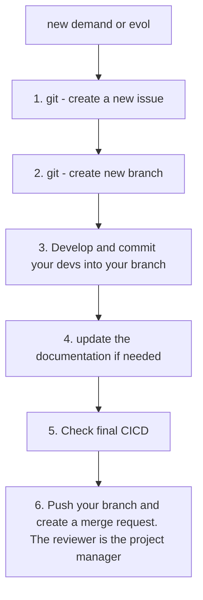

# Overview-CERITA: Creation of Repository and branches for developers

CERITA project

**Lorsque vous écrivez du code pour vous-même, la seule priorité est de le faire fonctionner. Cependant, travailler dans une équipe de développeurs exige de coordonner les actions de toutes les personnes travaillant sur le même code.**

# Convention 
## Step 0 - Schedule development




## Step 1 - Clone the template repository

```bash 
git clone git@github.com:nsengnk/cerita.git
cd cerita
```

## Step 2 - Create new branch
```bash
# Aller sur la branche principale
git checkout main
# Mettre à jour la branche avec les dernières modifications
git pull origin main
# Créer une nouvelle branche basée sur la branche principale
git checkout -b num_issue/feature_name
```
